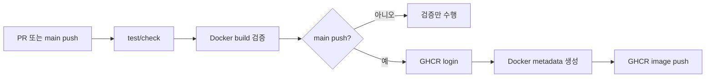

# MJUClaw 이미지 기반 배포

이 문서는 현재까지 구축된 MJUClaw 배포 구조를 정리한다. 목표는 운영 Windows PC에서 더 이상 여러 repo를 직접 clone/build하지 않고, GitHub Actions가 검증해 GHCR에 publish한 이미지를 pull해서 배포하는 것이다.

현재 배포 방식은 **승인 기반 CD**다. CI는 각 repo에서 자동으로 실행되고 이미지를 발행한다. `mjuclaw-setup`의 `main` push는 CI와 production dry-run 성공 후 `Production Deploy` workflow를 자동으로 approval 대기 상태까지 열 수 있다. 실제 운영 반영은 production approval을 통과한 뒤에만 진행되며, 운영자는 필요 시 GitHub Actions의 `Production Deploy` workflow를 수동 실행하거나 운영 PC에서 직접 `deploy.ps1`을 실행할 수도 있다.

---

## 현재 완료된 범위

완료된 배포 기반은 다음과 같다.

| 영역 | 상태 | 내용 |
|---|---|---|
| 서비스 CI | 완료 | 각 서비스 repo에서 테스트/빌드/Docker build 검증 |
| GHCR publish | 완료 | `main` push 시 GHCR image publish |
| Agent image | 완료 | `mjuclaw-setup`에서 `mjuclaw-agent` image build/publish |
| Production compose | 완료 | `docker-compose.prod.yml`로 GHCR image 기반 실행 |
| Release manifest | 완료 | `release.env.example`로 image/tag 조합 고정 방식 정의 |
| Windows deploy wrapper | 완료 | `deploy.ps1`로 pull/up 실행 |
| Health gating | 완료 | `deploy.ps1`이 agent/router/classifier health endpoint를 확인하고 실패 시 non-zero exit |
| Rollback 자동화 | 완료 | `.deploy/releases` snapshot 기반 수동 rollback과 `-RollbackOnFailure` 지원 |
| Preflight check | 완료 | `deploy.ps1 -CheckOnly`로 설정과 배포 대상 image/tag를 사전 검증 |
| Backup/restore runbook | 완료 | 운영 PC volume과 DB 백업/복구 절차 문서화 |
| Backup helper script | 완료 | `backup.ps1`로 운영 데이터 백업 생성 자동화 |
| Release candidate helper | 완료 | `prepare-release.ps1`로 `release.env` 후보 생성 |
| Smoke test helper | 완료 | `smoke-test.ps1`로 배포 후 service/worker smoke test와 기록 생성 |
| Production deploy smoke gating | 완료 | `Production Deploy` deploy mode에서 배포 후 `smoke-test.ps1` 실행과 기록 출력 |
| 운영 PC 반자동 리허설 | 완료 | release 후보 생성, 백업, 배포, smoke test 전체 흐름 검증 |
| Self-hosted runner 운영 기준 | 완료 | 운영 PC runner 보안/실행 경계와 실제 실행 기준 문서화 |
| Production dry-run workflow | 완료 | `workflow_dispatch` 기반 check-only workflow 추가 및 운영 PC dry-run 성공 확인 |
| 승인 기반 production deploy workflow | 완료 | `workflow_dispatch` + production approval 기반 실제 deploy mode 운영 PC 성공 확인 |
| Main push production dry-run | 완료 | `main` push의 CI 성공 후 운영 PC runner에서 check-only 검증 자동 실행 |
| Main push approval-gated deploy | 완료 | 자동 dry-run 성공 후 `Production Deploy`가 production approval 대기 |
| 완전 자동 CD | 미완료 | main push 즉시 자동 배포는 아직 도입하지 않음 |

---

## Repo별 역할

| Repo | 역할 | 배포 산출물 |
|---|---|---|
| `mjuclaw-router` | Discord gateway, onboarding, intent gate, OpenClaw gateway forwarding | `ghcr.io/university-claw/mjuclaw-router` |
| `mju-public-data-worker` | 공지/학식 public data 수집 및 정규화 worker | `ghcr.io/university-claw/mju-public-data-worker` |
| `intent-classifier` | abuse/intent classifier FastAPI service | `ghcr.io/university-claw/intent-classifier` |
| `mjuclaw-setup` | 운영 compose, agent image build context, 배포 wrapper | `ghcr.io/university-claw/mjuclaw-agent` |
| `mju-cli` | agent/router image에 포함되는 학사 CLI | 별도 image 없음 |
| `mju-public-data-reader` | agent image에 포함되는 public data reader CLI | 별도 image 없음 |

`mju-cli`와 `mju-public-data-reader`는 production compose에 직접 등장하지 않는다. 두 repo는 `mjuclaw-agent` 또는 `mjuclaw-router` Docker build context 안에 포함되는 구성요소다. `mju-public-data-reader`는 Dockerfile 호환을 위해 build context에서 기존 경로명인 `mju-news`로 checkout된다.

---

## CI 단계

CI는 GitHub Actions에서 PR과 `main` push에 실행된다. 현재 목적은 세 가지다.

1. 코드와 설정이 깨지지 않았는지 검증한다.
2. Docker image build가 가능한지 검증한다.
3. `main`에 merge된 검증된 조합을 GHCR image로 publish한다.

### 서비스 repo CI

각 서비스 repo는 대체로 아래 흐름을 따른다.



`main` push에서 발행되는 tag는 다음 규칙을 따른다.

- `main`: 최신 main smoke test용 tag
- `sha-<short-sha>`: 운영 release pinning용 tag

운영 배포에서는 `main`보다 `sha-*` tag를 사용한다. `main`은 움직이는 tag라서 rollback 기준으로 적합하지 않다.

### mjuclaw-setup CI

`mjuclaw-setup` CI는 두 job으로 나뉜다.

| Job | 역할 |
|---|---|
| `Test and config checks` | Node test, `setup.sh` 문법 검증, `deploy.ps1` 문법 검증, local/prod/ngrok compose config 검증 |
| `Agent Docker build and publish` | `mjuclaw-agent` image build, `main` push 시 GHCR publish |

`Test and config checks`는 다음을 검증한다.

- `npm test`
- `bash -n setup.sh`
- PowerShell parser로 `deploy.ps1` 문법 검증
- local compose config
- prod compose config
- prod `public-data` profile config
- prod + ngrok compose config
- `deploy.ps1 -CheckOnly` preflight 동작

`Agent Docker build and publish`는 `mjuclaw-agent` image를 만든다. 이때 build context로 다음 repo를 함께 checkout한다.

- `university-claw/mju-cli` -> `mju-cli`
- `university-claw/mju-public-data-reader` -> `mju-news`

`main` push에서 발행되는 agent image는 다음과 같다.

```text
ghcr.io/university-claw/mjuclaw-agent:main
ghcr.io/university-claw/mjuclaw-agent:sha-<short-sha>
```

---

## CD 단계

현재 CD는 운영자가 승인 시점을 직접 정하는 반자동 방식이다.

```mermaid
flowchart LR
  A["각 repo main merge"] --> B["GitHub Actions CI"]
  B --> C["GHCR image publish"]
  C --> D["mjuclaw-setup release.env에 sha tag 고정"]
  D --> E["운영 PC에서 deploy.ps1 -CheckOnly 실행"]
  E --> F["배포 대상 image/tag 확인"]
  F --> G["운영 PC에서 deploy.ps1 실행"]
  G --> H["docker compose config 검증"]
  H --> I["docker compose pull"]
  I --> J["docker compose up -d"]
  J --> K["자동 health check"]
  K --> L{"health 실패?"}
  L -- "아니오" --> M["배포 성공 기록"]
  L -- "예 + RollbackOnFailure" --> N["이전 성공 release로 rollback"]
```



운영 PC는 build를 수행하지 않는다. 운영 PC의 책임은 pinned image를 pull하고 compose로 띄우는 것이다.

### CD 입력 파일

운영 배포에는 로컬에만 존재하는 env 파일 두 개가 필요하다.

| 파일 | 역할 | 커밋 여부 |
|---|---|---|
| `.env.production` | secrets와 런타임 설정 | 커밋 금지 |
| `release.env` | 배포할 image/tag 조합 | 커밋 금지 |

`release.env`는 `release.env.example`을 복사해서 만든다.

```powershell
Copy-Item release.env.example release.env
notepad release.env
```

예시는 다음 형태다.

```env
AGENT_IMAGE=ghcr.io/university-claw/mjuclaw-agent
AGENT_TAG=sha-replace-me

ROUTER_IMAGE=ghcr.io/university-claw/mjuclaw-router
ROUTER_TAG=sha-replace-me

WORKER_IMAGE=ghcr.io/university-claw/mju-public-data-worker
WORKER_TAG=sha-replace-me

CLASSIFIER_IMAGE=ghcr.io/university-claw/intent-classifier
CLASSIFIER_TAG=sha-replace-me
```

`release.env`에 `sha-replace-me` 같은 placeholder가 남아 있으면 `deploy.ps1`이 배포를 중단한다.

실제 컨테이너를 바꾸기 전에 아래 명령으로 preflight를 먼저 실행한다.

```powershell
.\deploy.ps1 -CheckOnly
```

`-CheckOnly`는 Docker와 필수 파일을 확인하고 compose config를 검증한 뒤, 실제로 배포될 image/tag 조합을 출력한다. 이 모드에서는 image pull, `up -d`, health check, rollback, `.deploy/` 기록 생성을 수행하지 않는다.

---

## 운영 PC 첫 이미지 배포 검증 기록

2026년 5월 16일 운영 Windows PC에서 로컬 build 기반 배포를 GHCR image 기반 배포로 전환했다.

검증된 최초 image 조합:

```env
AGENT_TAG=sha-31b83b7
ROUTER_TAG=sha-4387626
WORKER_TAG=sha-b27a9be
CLASSIFIER_TAG=sha-57addcf
```

실행한 검증 순서:

```powershell
docker login ghcr.io -u <github-user>
.\deploy.ps1 -CheckOnly
.\deploy.ps1 -PullOnly
.\deploy.ps1 -NoPull -RollbackOnFailure
```

확인된 정상 신호:

- GHCR 인증 후 image pull 성공
- `deploy.ps1 -CheckOnly`가 image/tag 조합과 compose config를 검증
- `deploy.ps1 -PullOnly`가 service 변경 없이 image만 pull
- `deploy.ps1 -NoPull -RollbackOnFailure`가 성공하고 `.deploy/releases/<timestamp>/deploy.json`에 `status: succeeded` 기록
- 실행 중인 서비스가 GHCR image tag를 사용
- `mjuclaw-worker` legacy 컨테이너 제거 완료
- `mjuclaw-public-data-worker` 단일 scheduler worker만 실행
- router, agent LLM, 실제 Discord 대화 smoke test 성공
- worker `doctor`와 `schedule tick --dry-run` 성공

첫 전환 중 확인한 이슈:

- GHCR private package pull에는 `read:packages` 권한이 있는 GitHub access token이 필요하다.
- 첫 `-RollbackOnFailure` 실행에서는 성공 snapshot이 없으므로 자동 rollback 기준점이 없다. 첫 성공 배포 후부터 `-RollbackOnFailure`가 실질적인 rollback 보호막이 된다.
- Windows PowerShell에서 native stderr가 health retry loop를 깨던 문제가 있었고, `deploy.ps1`의 capture 로직을 수정했다.
- host asset 폴더와 Docker volume에 일부 파일 차이가 있었다. PR10 이후 운영 기준 asset store는 Docker volume `public-data-assets`다.

---

## 운영 PC 반자동 배포 리허설 기록

2026년 5월 16일 운영 Windows PC에서 반자동 CD 전체 흐름을 리허설했고 성공을 확인했다.

검증한 흐름:

```powershell
git switch main
git pull --ff-only origin main
.\prepare-release.ps1 -CheckOnly
.\prepare-release.ps1
# 후보 release.env/release.json 확인 후 release.env 적용
.\deploy.ps1 -CheckOnly
.\deploy.ps1 -PullOnly
.\backup.ps1 -CheckOnly
.\backup.ps1
.\deploy.ps1 -RollbackOnFailure
```

확인한 산출물:

- `.deploy\release-candidates\<timestamp>\release.env`
- `.deploy\release-candidates\<timestamp>\release.json`
- `.deploy\backups\<timestamp>\backup.json`
- `.deploy\backups\<timestamp>\*.tar.gz`
- `.deploy\backups\<timestamp>\public-data-db.dump`
- `.deploy\releases\<timestamp>\release.env`
- `.deploy\releases\<timestamp>\deploy.json`

정상 기준:

- `prepare-release.ps1`가 후보 `release.env`를 만들고 기본 실행만으로 운영 `release.env`를 덮어쓰지 않음
- 후보 확인 후 운영 `release.env` 적용
- `deploy.ps1 -CheckOnly`가 적용된 image/tag 조합을 검증
- `deploy.ps1 -PullOnly`가 GHCR image pull을 검증
- `backup.ps1`가 배포 전 백업 산출물과 `backup.json` manifest를 생성
- `deploy.ps1 -RollbackOnFailure`가 성공하고 최신 `deploy.json`에 `status: succeeded` 기록
- 배포 후 Discord, LLM, router, public data worker smoke test 성공

이 리허설 이후 현재 반자동 CD의 운영 단위는 다음처럼 정리된다.

```text
release 후보 생성
  -> 운영자 확인 및 release.env 적용
  -> preflight
  -> image pull
  -> 배포 전 백업
  -> 배포
  -> smoke test
  -> 성공 snapshot 보존
```

---

## 반복 배포 Runbook

일반적인 운영 배포는 아래 순서로 진행한다.

1. 각 서비스 repo의 PR을 main에 merge하고 GitHub Actions가 GHCR image를 publish했는지 확인한다.
2. 운영 PC의 `mjuclaw-setup`을 최신 main으로 갱신한다.

```powershell
cd C:\Users\yoonh\Desktop\mjuclaw-setup
git switch main
git pull --ff-only origin main
```

3. `release.env` 후보를 생성한다.

```powershell
.\prepare-release.ps1
```

`prepare-release.ps1`은 각 서비스 repo의 `main` HEAD를 읽어 `sha-*` tag 조합을 만들고, 기본적으로 `.deploy\release-candidates\<timestamp>\release.env`와 `release.json`만 생성한다. `release.env`를 바로 덮어쓰지 않는다.

자주 쓰는 옵션:

```powershell
.\prepare-release.ps1 -CheckOnly -SkipImageVerify
.\prepare-release.ps1 -SkipImageVerify
.\prepare-release.ps1 -Apply
.\prepare-release.ps1 -OutputRoot .deploy\release-candidates
```

확인할 것:

- `release.json`의 repo별 commit이 배포하려는 main commit과 일치
- 후보 `release.env`의 image/tag 조합이 의도와 일치
- `-SkipImageVerify` 없이 실행했을 때 GHCR image tag 검증 성공

GHCR image publish가 아직 끝나지 않았으면 image 검증이 실패할 수 있다. 이 경우 배포하지 말고 GitHub Actions publish 완료 후 다시 실행한다.

후보를 확인한 뒤 수동으로 적용한다.

```powershell
$latest = Get-ChildItem .deploy\release-candidates | Sort-Object Name -Descending | Select-Object -First 1
Copy-Item (Join-Path $latest.FullName "release.env") .\release.env
```

또는 후보 생성과 적용을 한 번에 실행한다.

```powershell
.\prepare-release.ps1 -Apply
```

4. 실제 변경 전 preflight를 실행한다.

```powershell
.\deploy.ps1 -CheckOnly
```

확인할 것:

- `release.env`에 placeholder가 없음
- 출력된 agent/router/worker/classifier image tag가 의도한 조합과 일치
- compose config 검증 성공
- 이 단계에서 image pull, service 변경, `.deploy/` 기록 생성이 없음

5. image pull만 먼저 검증한다.

```powershell
.\deploy.ps1 -PullOnly
```

확인할 것:

- GHCR 권한 문제 없음
- 모든 image pull 성공
- service start 없음

6. 실제 배포를 실행한다.

```powershell
.\deploy.ps1 -RollbackOnFailure
```

이미 같은 image 조합을 pull해 둔 상태에서 script/compose 변경만 반영하려면 아래처럼 pull을 생략할 수 있다.

```powershell
.\deploy.ps1 -NoPull -RollbackOnFailure
```

7. 성공 snapshot을 확인한다.

```powershell
$latest = Get-ChildItem .deploy\releases | Sort-Object Name -Descending | Select-Object -First 1
Get-Content (Join-Path $latest.FullName "deploy.json")
```

`deploy.json`의 `status`가 `succeeded`이면 다음 rollback 기준점으로 사용할 수 있다.

---

## Compose 구조

이 repo에는 두 가지 compose 경로가 있다.

| 파일 | 용도 |
|---|---|
| `docker-compose.yml` | 로컬 개발/초기 세팅용 build 기반 compose |
| `docker-compose.prod.yml` | 운영 배포용 GHCR image 기반 compose |
| `docker-compose.ngrok.yml` | ngrok tunnel profile |

운영에서는 `docker-compose.prod.yml`을 사용한다. 이 파일에는 `build:`가 없고 `image:`만 있다.

운영 기본 서비스는 다음 네 가지다.

- `mjuclaw-agent`
- `mjuclaw-router`
- `mjuclaw-classifier`
- `mjuclaw-public-data-worker`

옵션 profile:

- `ngrok`: `docker-compose.ngrok.yml`과 함께 사용
- `public-data`: bundled Postgres와 단일 `mjuclaw-public-data-worker` 사용

운영 PC의 `.env.production`에는 `COMPOSE_PROFILES=public-data`를 설정한다. 이 profile이 꺼지면 bundled Postgres와 `mjuclaw-public-data-worker`가 실행되지 않는다.

운영 compose에서는 `mjuclaw-worker`를 별도로 띄우지 않는다. public data 수집 scheduler는 `mjuclaw-public-data-worker` 하나만 실행한다.

public data 원본 첨부/이미지는 Docker volume인 `public-data-assets`에 저장된다. `mjuclaw-public-data-worker`는 이 volume을 `/data/assets`에 write mount하고, `mjuclaw-agent`는 같은 volume을 `/data/assets:ro`로 read-only mount한다.

기존 운영 PC에서 host bind mount `${STORAGE_LOCAL_ROOT}`를 사용해 왔다면, PR10 배포 전에 host asset을 Docker volume으로 병합한다. 이 명령은 host 파일을 삭제하지 않고, 없는 파일만 volume 쪽에 보강하는 용도다.

```powershell
$source = (Select-String -Path .env.production -Pattern '^STORAGE_LOCAL_ROOT=').Line -replace '^STORAGE_LOCAL_ROOT=', ''
docker run --rm --mount "type=bind,source=$source,target=/from,readonly" --mount "type=volume,source=mjuclaw-setup_public-data-assets,target=/to" alpine sh -c "cd /from && cp -a . /to/"
```

---

## 배포 스크립트

기본 배포 명령은 다음과 같다.

```powershell
.\deploy.ps1
```

자주 쓰는 옵션은 다음과 같다.

```powershell
.\deploy.ps1 -Ngrok
.\deploy.ps1 -CheckOnly
.\deploy.ps1 -PullOnly
.\deploy.ps1 -NoPull
.\deploy.ps1 -SkipHealthCheck
.\deploy.ps1 -RollbackOnFailure
.\deploy.ps1 -RollbackLatest
.\deploy.ps1 -Rollback .deploy\releases\20260515-123000
.\deploy.ps1 -EnvFile .env.production -ReleaseFile release.env
.\deploy.ps1 -HealthTimeoutSeconds 180 -HealthIntervalSeconds 10
```

스크립트가 수행하는 일:

1. Docker CLI 존재 확인
2. Docker daemon 동작 확인
3. Docker Compose 동작 확인
4. `.env.production` 확인
5. `release.env` 확인
6. `release.env` placeholder tag 방지
7. compose config 검증
8. `-CheckOnly`이면 배포할 image/tag 조합 출력 후 종료
9. image pull
10. `docker compose up -d`
11. legacy `mjuclaw-worker` orphan 컨테이너 제거
12. `docker compose ps` 출력
13. agent/router/classifier health check
14. public-data worker 최근 로그 출력
15. `.deploy/releases/<timestamp>`에 배포 기록 저장

옵션별 동작:

| 옵션 | 동작 |
|---|---|
| `-Ngrok` | `docker-compose.ngrok.yml`과 `ngrok` profile 포함 |
| `-CheckOnly` | Docker/env/release/compose 설정과 배포 대상 image/tag만 검증. image pull과 service 변경 없음 |
| `-PullOnly` | image pull까지만 수행하고 서비스 시작 생략 |
| `-NoPull` | 이미 pull된 image로 `up -d`만 수행 |
| `-SkipHealthCheck` | 배포 후 자동 health check 생략 |
| `-WaitHealthy` | health check 실행 의도를 명시적으로 드러내는 옵션. 기본값도 health check 실행 |
| `-HealthTimeoutSeconds` | health check 전체 대기 시간. 기본 120초 |
| `-HealthIntervalSeconds` | health 재시도 간격. 기본 5초 |
| `-RollbackOnFailure` | health check 실패 시 직전 성공 snapshot으로 자동 rollback |
| `-RollbackLatest` | 가장 최근 성공 snapshot으로 rollback |
| `-Rollback <path>` | 지정한 snapshot 디렉터리 또는 `release.env` 파일로 rollback |
| `-EnvFile` | 기본 `.env.production` 대신 지정한 env 파일 사용 |
| `-ReleaseFile` | 기본 `release.env` 대신 지정한 release manifest 사용 |

---

## 수동 배포 명령

`deploy.ps1`이 수행하는 기본 배포 명령은 아래와 같다.

```powershell
docker compose --env-file .env.production --env-file release.env -f docker-compose.prod.yml pull
docker compose --env-file .env.production --env-file release.env -f docker-compose.prod.yml up -d
```

ngrok까지 함께 띄울 때는 아래 명령을 사용한다.

```powershell
docker compose --env-file .env.production --env-file release.env -f docker-compose.prod.yml -f docker-compose.ngrok.yml --profile ngrok pull
docker compose --env-file .env.production --env-file release.env -f docker-compose.prod.yml -f docker-compose.ngrok.yml --profile ngrok up -d
```

GHCR package가 private이면 image를 pull하기 전에 로그인한다.

```powershell
docker login ghcr.io -u <github-user>
```

password 입력란에는 GitHub 계정 비밀번호가 아니라 `read:packages` 권한이 있는 GitHub access token을 입력한다. 배포 PC용 token은 만료일을 두고 운영하며, 만료 전 갱신 일정을 별도로 관리한다.

---

## Health Check

배포 후 최소한 아래 상태를 확인한다.

```powershell
docker compose --env-file .env.production --env-file release.env -f docker-compose.prod.yml ps
docker exec mjuclaw-agent curl -sS http://localhost:3001/health
docker exec mjuclaw-router curl -sS http://localhost:3100/healthz
docker exec mjuclaw-classifier curl -sS http://localhost:3200/healthz
docker logs mjuclaw-public-data-worker --tail 20
```

정상 신호:

- `mjuclaw-agent`, `mjuclaw-router`, `mjuclaw-classifier`, `mjuclaw-public-data-worker`가 Up 상태
- agent `/health` 응답 성공
- router `/healthz` 응답 성공
- classifier `/healthz` 응답 성공
- worker 로그에서 반복적인 crash/restart가 없음
- `mjuclaw-worker` legacy 컨테이너가 남아 있지 않음

실패 신호:

- compose service가 Restarting 또는 Exited 상태
- `mjuclaw-worker`와 `mjuclaw-public-data-worker`가 동시에 실행됨
- health endpoint가 timeout 또는 non-2xx 응답
- router가 Discord gateway에 연결하지 못함
- agent가 LLM/tool call 단계에서 반복 실패
- worker가 DB 연결 또는 OCR 초기화에서 반복 실패

`deploy.ps1`은 기본적으로 배포 후 agent/router/classifier health endpoint를 확인한다. 제한 시간 안에 모든 endpoint가 성공하지 않으면 non-zero exit로 종료한다. health check를 생략해야 하는 특수 상황에서는 `-SkipHealthCheck`를 명시한다.

`-RollbackOnFailure`를 함께 사용하면 health check 실패 시 직전 성공 snapshot의 `release.env`로 자동 rollback을 시도한다.

---

## Smoke Test Checklist

배포 후에는 health check만 보지 말고 실제 사용자 흐름을 한 번 확인한다.

기본 smoke test helper:

```powershell
.\smoke-test.ps1 -CheckOnly
.\smoke-test.ps1
```

`smoke-test.ps1`는 다음 항목을 검증한다.

- Docker daemon 접근 가능 여부
- agent `/health`
- router `/healthz`
- classifier `/healthz`
- legacy `mjuclaw-worker` container 부재
- public data worker container 실행 상태
- public data worker `doctor`
- public data worker `schedule tick --dry-run`

결과는 `.deploy\smoke-tests\<timestamp>\smoke-test.json`에 저장된다. 실패하면 non-zero exit로 종료하므로 운영자가 실패 원인을 확인한 뒤 rollback 또는 재배포를 결정한다.

public data worker 검증을 잠시 제외해야 하는 경우에만 아래 옵션을 사용한다.

```powershell
.\smoke-test.ps1 -SkipPublicDataWorker
```

Discord/LLM smoke는 아직 자동화하지 않는다. 배포 후 운영자가 아래 흐름을 수동으로 확인한다.

- Discord에서 실제 대화 1회 전송
- router 로그에서 Discord client ready와 메시지 처리 확인
- agent가 LLM 응답을 반환하는지 확인
- 사용자 session이 `discord-<user-id>` 기준으로 분리되는지 확인

필요할 때만 public data 실제 수집을 1건 실행한다.

```powershell
docker exec mjuclaw-public-data-worker node dist/main.js collect notices --limit 1
```

학식 수집은 OCR과 외부 source가 얽혀 공지 수집보다 무겁다. 필요한 경우에만 별도로 실행한다.

```powershell
docker exec mjuclaw-public-data-worker node dist/main.js collect cafeterias --limit 1
```

worker 구성 확인:

```powershell
docker ps --format "table {{.Names}}\t{{.Image}}\t{{.Status}}" | Select-String worker
```

정상 상태는 `mjuclaw-public-data-worker`만 보이는 것이다. `mjuclaw-worker`가 함께 보이면 중복 scheduler 상태이므로 실패로 본다.

---

## 배포 기록과 rollback

`deploy.ps1`은 실행할 때마다 `.deploy/releases/<timestamp>` 디렉터리를 만들고 현재 배포에 사용한 `release.env` snapshot과 `deploy.json` 메타데이터를 저장한다.

`.deploy/`는 운영 PC의 로컬 기록이며 git에 커밋하지 않는다.

`-RollbackOnFailure`와 `-RollbackLatest`는 이전에 성공으로 기록된 snapshot이 있을 때만 사용할 수 있다. 첫 배포 전에는 rollback 대상이 없으므로, 첫 성공 배포 후부터 자동 rollback이 의미를 가진다.

배포 기록에는 다음 정보가 남는다.

- 배포 mode: `deploy` 또는 `rollback`
- 시작/종료 시각
- 사용한 env 파일 경로
- 사용한 release manifest 경로
- snapshot된 `release.env`
- ngrok 사용 여부
- health check 설정
- 배포 결과 상태
- 실패 메시지와 rollback 대상

가장 최근 성공 배포로 rollback하려면 아래 명령을 사용한다.

```powershell
.\deploy.ps1 -RollbackLatest
```

rollback 후에도 동일한 health/smoke test를 다시 실행한다. rollback이 성공하면 `.deploy/releases/<timestamp>/deploy.json`에 `status: rollback-succeeded`가 기록된다.

특정 snapshot으로 rollback하려면 snapshot 디렉터리 또는 snapshot 안의 `release.env`를 지정한다.

```powershell
.\deploy.ps1 -Rollback .deploy\releases\20260515-123000
.\deploy.ps1 -Rollback .deploy\releases\20260515-123000\release.env
```

rollback도 일반 배포와 동일하게 compose config 검증, image pull, `up -d`, health check를 수행한다. pull을 생략해야 하는 경우에만 `-NoPull`을 함께 사용한다.

---

## 운영 데이터 Backup/Restore Runbook

이 절차는 운영 Windows PC의 Docker Desktop 데이터 초기화, PC 교체, volume 손상 상황에서 서비스를 복구하기 위한 기준이다. 백업 생성은 `backup.ps1`로 자동화하고, restore는 운영 데이터를 덮어쓸 수 있으므로 수동 runbook으로 유지한다.

### 백업 대상

| 대상 | 백업 방식 | 복구 필요도 |
|---|---|---|
| `.env.production` | 파일 복사 | 필수. secrets와 runtime 설정 |
| `release.env` | 파일 복사 | 필수. 복구 시 띄울 image/tag 조합 |
| `docker-compose.prod.yml` | 파일 복사 | 권장. 당시 compose 기준 보존 |
| `docker-compose.ngrok.yml` | 파일 복사 | ngrok 사용 시 권장 |
| `agent-data` | Docker volume tar | 필수. OpenClaw config, 세션, cron, view-store |
| `router-data` | Docker volume tar | 권장. router pairing/device state |
| `user-data` | Docker volume tar | `MJU_STORAGE=postgres`가 아닌 데이터가 남아 있을 수 있으므로 보존 |
| `public-data-assets` | Docker volume tar | 필수. 공지/학식 원본 첨부와 이미지 |
| `public-data-db` | `pg_dump -Fc` | 필수. public data DB |
| `public-data-paddle-models` | 백업 생략 | cache 성격. 새 PC에서 다시 받을 수 있음 |

`public-data-db`는 volume tar보다 `pg_dump`를 기본 백업 방식으로 사용한다. 실행 중인 Postgres 데이터 디렉터리를 그대로 tar로 묶는 방식은 복구 안정성이 낮다.

### 백업 생성

운영 PC의 `mjuclaw-setup` repo에서 실행한다. 기본 백업 명령은 다음과 같다.

```powershell
cd C:\Users\yoonh\Desktop\mjuclaw-setup
.\backup.ps1
```

자주 쓰는 옵션:

```powershell
.\backup.ps1 -CheckOnly
.\backup.ps1 -OutputRoot .deploy\backups
.\backup.ps1 -EnvFile .env.production -ReleaseFile release.env
.\backup.ps1 -ComposeProjectName mjuclaw-setup
.\backup.ps1 -SkipDbDump
.\backup.ps1 -IncludePaddleModels
```

`backup.ps1`이 수행하는 작업:

1. Docker CLI, env 파일, release 파일, compose 파일 존재 확인
2. Docker daemon과 필수 volume 존재 확인
3. `.deploy\backups\<timestamp>` 디렉터리 생성
4. `.env.production`, `release.env`, compose 파일 복사
5. `agent-data`, `router-data`, `user-data`, `public-data-assets` volume을 tar archive로 export
6. `public-data-db`를 `pg_dump -Fc`로 dump
7. 산출물 SHA256을 계산해 `backup.json` manifest 생성

`-CheckOnly`는 입력 파일과 백업 대상 계획만 확인하고, 백업 디렉터리나 산출물을 만들지 않는다.

Docker volume은 compose project 이름을 포함한 실제 volume 이름으로 백업한다. 기본 project 이름은 repo 디렉터리명 기준 `mjuclaw-setup`이다.

```powershell
docker volume ls --format "{{.Name}}" | Select-String "mjuclaw-setup_"
```

`COMPOSE_PROJECT_NAME`을 별도로 지정한 환경이라면 `-ComposeProjectName` 값을 실제 volume prefix에 맞춘다.

백업 결과를 확인한다. `backup.json`에는 산출물 이름, 종류, 크기, SHA256이 기록된다.

```powershell
Get-ChildItem .deploy\backups | Sort-Object Name -Descending | Select-Object -First 1
$latest = Get-ChildItem .deploy\backups | Sort-Object Name -Descending | Select-Object -First 1
Get-Content (Join-Path $latest.FullName "backup.json")
```

백업 디렉터리에는 secrets가 포함된다. `.deploy/`는 gitignore 대상이지만, 운영 PC 밖으로 복사할 때도 개인 저장소나 암호화된 저장소에만 보관한다.

### 복구 순서

복구 대상 PC에서 Docker Desktop과 Git을 준비하고 `mjuclaw-setup`을 clone한다. 이후 백업 디렉터리를 repo 안의 `.deploy\restore\<timestamp>` 같은 위치에 둔다.

```powershell
cd C:\Users\yoonh\Desktop\mjuclaw-setup

$restoreRoot = ".deploy\restore\20260516-120000"
Copy-Item (Join-Path $restoreRoot ".env.production") .env.production
Copy-Item (Join-Path $restoreRoot "release.env") release.env
```

GHCR 접근을 확인하고 image를 먼저 내려받는다.

```powershell
docker login ghcr.io -u <github-user>
.\deploy.ps1 -CheckOnly
.\deploy.ps1 -PullOnly
```

DB가 아닌 volume을 먼저 복원한다. 기본 전제는 새 PC 또는 비어 있는 Docker volume으로의 복구다. 기존 volume에 복원하면 같은 경로의 파일은 덮어쓰지만 snapshot에 없는 오래된 파일은 자동으로 지우지 않는다. 기존 운영 PC에서 실행할 때는 반드시 별도 백업을 만든 뒤 진행한다.

```powershell
$restorePath = (Resolve-Path $restoreRoot).Path
$project = "mjuclaw-setup"
$volumeNames = @("agent-data", "router-data", "user-data", "public-data-assets")

foreach ($name in $volumeNames) {
  $volume = "${project}_${name}"
  docker volume create $volume
  docker run --rm `
    --mount "type=volume,source=$volume,target=/data" `
    --mount "type=bind,source=$restorePath,target=/backup,readonly" `
    alpine sh -c "cd /data && tar xzf /backup/$($name).tar.gz"
}
```

Postgres 컨테이너를 먼저 띄우고 dump를 복원한다.

```powershell
docker compose --env-file .env.production --env-file release.env -f docker-compose.prod.yml --profile public-data up -d public-data-db
docker cp (Join-Path $restoreRoot "public-data-db.dump") "mjuclaw-public-data-db:/tmp/public-data-db.dump"
docker exec mjuclaw-public-data-db sh -c 'pg_restore --clean --if-exists -U "$POSTGRES_USER" -d "$POSTGRES_DB" /tmp/public-data-db.dump'
docker exec mjuclaw-public-data-db rm -f /tmp/public-data-db.dump
```

전체 서비스를 올린다.

```powershell
.\deploy.ps1 -NoPull
```

복구 직후에는 아직 성공 snapshot이 없을 수 있으므로 `-RollbackOnFailure`가 실질적인 보호를 제공하지 못할 수 있다. 첫 복구 배포가 성공하면 이후부터 해당 성공 기록을 rollback 기준점으로 사용할 수 있다.

### 복구 검증

복구 후에는 아래 순서로 검증한다.

1. `docker compose --env-file .env.production --env-file release.env -f docker-compose.prod.yml ps`
2. agent/router/classifier health check
3. `mjuclaw-public-data-worker` `doctor`
4. `schedule tick --dry-run`
5. 실제 Discord 대화 1회
6. 기존 사용자 session 분리 기준 확인
7. `mjuclaw-worker` legacy 컨테이너가 없는지 확인

검증 명령은 `Smoke Test Checklist` 섹션의 명령을 그대로 사용한다. 복구가 성공하면 현재 `release.env` 기준으로 `.\deploy.ps1 -NoPull -RollbackOnFailure`를 한 번 더 실행해 성공 snapshot을 남길 수 있다.

### 운영 원칙

- 백업은 배포 전, Docker Desktop 업데이트 전, Windows 재부팅/장애 조치 전처럼 위험한 작업 전에 만든다.
- `.env.production`, `release.env`, DB dump에는 secrets 또는 사용자 데이터가 포함될 수 있으므로 공유 채널에 올리지 않는다.
- `public-data-paddle-models`는 cache라 기본 백업에서 제외한다. 복구 후 worker가 필요할 때 다시 내려받는다.
- restore는 자동화하지 않는다. 추후 script를 만들더라도 `-DryRun`, 대상 경로 확인, 명시적 confirmation을 요구하는 별도 PR로 다룬다.

---

## 현재 파이프라인 요약

현재 완성된 흐름은 아래와 같다.

```text
개발 repo PR
  -> GitHub Actions test/build/docker 검증
  -> main merge
  -> GHCR image publish (:main, :sha-<short-sha>)
  -> mjuclaw-setup prepare-release.ps1로 release.env 후보 생성
  -> 운영자가 후보 release.env와 release.json 확인
  -> release.env 적용
  -> 운영 Windows PC에서 .\deploy.ps1 -CheckOnly 실행
  -> compose config와 image/tag 조합 확인
  -> 운영 Windows PC에서 .\deploy.ps1 -PullOnly 실행
  -> 운영 Windows PC에서 .\backup.ps1 실행
  -> 운영 Windows PC에서 .\deploy.ps1 실행
  -> docker compose pull
  -> docker compose up -d
  -> 자동 health check
  -> 성공/실패 배포 기록 저장
  -> 실패 시 필요하면 이전 성공 snapshot으로 rollback
```

이 구조의 핵심은 운영 배포 단위를 “현재 로컬 checkout 상태”가 아니라 “검증된 image tag 조합”으로 바꾸는 것이다. 따라서 운영 PC에서 어느 commit이 떠 있는지 추적할 때는 `release.env`의 `sha-*` tag 조합을 보면 된다.

---

## Self-hosted Runner 운영 기준

이 단계는 `main` push 즉시 자동 배포를 켜는 것이 아니다. 목표는 Windows 운영 PC에 GitHub self-hosted runner를 붙이되, 보안 경계, 실행 위치, 승인 절차를 고정한 승인 기반 반자동 CD로 운영하는 것이다.

self-hosted runner는 GitHub Actions job을 운영 PC에서 실행한다. 따라서 운영 PC runner는 일반 CI runner가 아니라 production 변경 권한을 가진 운영 자동화 진입점으로 취급한다.

### 도입 원칙

- 완전 자동 배포를 `main` push에 바로 연결하지 않는다.
- 실제 deploy workflow는 `workflow_dispatch` 수동 실행만 허용한다.
- `main` push 자동화는 check-only dry-run workflow에만 허용한다.
- `pull_request`, fork, 임의 branch code가 운영 runner에서 실행되지 않게 한다.
- 운영 PC runner는 `mjuclaw-setup` repo 전용 repo-level runner로 제한한다.
- workflow는 GitHub Actions workspace가 아니라 운영 PC의 고정 checkout인 `C:\Users\yoonh\Desktop\mjuclaw-setup`에서 배포 스크립트를 실행한다.
- `.env.production`, `release.env`, `.deploy/`는 계속 운영 PC 로컬 파일로 유지하고 GitHub secrets로 대량 이관하지 않는다.
- GitHub Environment `production`의 required reviewer 승인 전에는 실제 배포 job이 실행되지 않게 한다.
- runner가 붙은 뒤에도 기본 운영 방식은 `prepare-release -> backup -> deploy -> smoke test` 순서를 유지한다.

### Runner 설정 기준

운영 PC runner는 다음 기준으로 등록한다.

| 항목 | 기준 |
|---|---|
| runner scope | `university-claw/mjuclaw-setup` repo-level runner |
| runner labels | `self-hosted`, `Windows`, `mjuclaw-prod-windows` |
| 실행 계정 | Docker Desktop과 `C:\Users\yoonh\Desktop\mjuclaw-setup` 접근 권한이 있는 Windows 계정 |
| 네트워크 | GitHub Actions outbound HTTPS, GHCR pull, 기존 서비스 외부 연결 가능 |
| 로컬 checkout | `C:\Users\yoonh\Desktop\mjuclaw-setup` |
| 로컬 secrets | `.env.production`, `release.env`, Docker GHCR login credential |
| Git 인증 | runner 실행 계정에서 `git fetch origin main`과 `git pull --ff-only origin main`이 비대화형으로 성공해야 함 |
| 금지 | PR job, 테스트 job, 임의 shell 실험을 production runner에서 실행 |

workflow의 `runs-on`은 generic `self-hosted`만 쓰지 않고, 반드시 production runner label까지 포함한다.

```yaml
runs-on: [self-hosted, Windows, mjuclaw-prod-windows]
```

### GitHub Environment 설정

`mjuclaw-setup` repo에 `production` environment를 만들고 아래 설정을 적용한다.

| 설정 | 기준 |
|---|---|
| Required reviewers | 최소 1명 |
| Prevent self-review | 가능하면 활성화 |
| Deployment branches | `main`만 허용 |
| Environment secrets | 최소화. 앱 runtime secrets는 운영 PC `.env.production`에 유지 |
| Environment variables | 필요 시 runner 고정 경로 같은 비밀이 아닌 값만 사용 |

`Production Deploy` workflow는 수동 `workflow_dispatch`와 자동 `workflow_run`을 지원한다. 수동 실행에서는 `mode` 입력으로 `dry-run` 또는 `deploy`를 선택한다. 자동 실행에서는 `Production Dry Run` workflow가 성공한 경우에만 deploy job이 열리고, 실제 배포는 production environment approval 이후에만 수행된다.

`Production Dry Run` workflow는 `main` push 자체가 아니라 `CI` workflow 성공 완료 후 또는 수동 `workflow_dispatch`로 실행된다. 같은 push에서 발행되는 `mjuclaw-agent:sha-*` image가 GHCR에 올라오기 전에 dry-run이 먼저 image tag를 검사하는 race condition을 막기 위해 `workflow_run`을 사용한다. 이 workflow는 production environment approval을 사용하지 않는다. 대신 운영 PC runner에서 check-only 명령만 실행하고, image pull, backup 생성, compose up, 실제 smoke test, deploy, rollback은 수행하지 않는다.

### Workflow 단계 기준

`dry-run` mode는 실제 배포 없이 check-only만 수행한다.

```text
workflow_dispatch
  -> mode: dry-run
  -> production environment approval
  -> runs-on: [self-hosted, Windows, mjuclaw-prod-windows]
  -> cd C:\Users\yoonh\Desktop\mjuclaw-setup
  -> git fetch origin
  -> git switch main
  -> git pull --ff-only origin main
  -> .\prepare-release.ps1 -CheckOnly
  -> .\deploy.ps1 -CheckOnly
  -> .\backup.ps1 -CheckOnly
```

이 workflow는 `actions/checkout`을 사용하지 않는다. GitHub Actions workspace 대신 운영 PC의 고정 checkout인 `C:\Users\yoonh\Desktop\mjuclaw-setup`으로 이동해 `git pull --ff-only origin main`을 실행한다. 운영 checkout에 커밋되지 않은 변경이 있으면 중단한다.

수동 `dry-run` mode의 완료 기준:

- `workflow_dispatch`에서 `mode: dry-run`으로 실행된다.
- production environment와 `mjuclaw-prod-windows` runner label을 사용한다.
- 운영 checkout에서만 `prepare-release`, `deploy`, `backup` check-only를 실행하도록 제한한다.
- image pull, backup 생성, compose up은 수행하지 않는다.

PR17 merge 후 운영 리허설 완료 기준:

- GitHub UI에서 workflow를 main 기준으로 수동 실행한다.
- production environment approval 없이는 job이 실행되지 않는다.
- 승인 후 runner가 workflow job을 수신한다.
- 운영 checkout에서 최신 main을 fast-forward한다.
- `prepare-release`, `deploy`, `backup` check-only가 통과한다.
- `.deploy\release-candidates`, `.deploy\backups`, `.deploy\releases`에 새 산출물이 생성되지 않는다.

`Production Dry Run` 자동 workflow는 `main` push의 `CI` workflow가 성공한 뒤 실제 배포 없이 check-only만 수행한다.

```text
main push
  -> CI
  -> Agent Docker build and publish
  -> Production Dry Run workflow_run
  -> runs-on: [self-hosted, Windows, mjuclaw-prod-windows]
  -> cd C:\Users\yoonh\Desktop\mjuclaw-setup
  -> git fetch origin
  -> workflow_run head_sha가 현재 origin/main인지 확인
  -> git switch main
  -> git pull --ff-only origin main
  -> .\prepare-release.ps1 -CheckOnly
  -> .\deploy.ps1 -CheckOnly
  -> .\backup.ps1 -CheckOnly
  -> .\smoke-test.ps1 -CheckOnly
```

자동 dry-run의 완료 기준:

- `main` push의 `CI` workflow가 성공한 뒤 `Production Dry Run` workflow가 자동 실행된다.
- production runner가 job을 수신한다.
- CI 완료 이벤트의 `head_sha`가 현재 `origin/main`과 다르면 오래된 dry-run으로 보고 검증 단계를 건너뛴다.
- 운영 checkout에서 최신 main을 fast-forward한다.
- `prepare-release`, `deploy`, `backup`, `smoke-test` check-only가 통과한다.
- `release.env` 적용, image pull, backup 생성, compose up, 실제 smoke test는 수행하지 않는다.
- `.deploy\release-candidates`, `.deploy\backups`, `.deploy\releases`, `.deploy\smoke-tests`에 새 산출물이 생성되지 않는다.

`Production Deploy` 자동 workflow는 자동 dry-run이 성공한 뒤 production approval 대기 상태로 열린다.

```text
main push
  -> CI
  -> Production Dry Run
  -> Production Deploy workflow_run
  -> source workflow head_sha가 현재 origin/main인지 확인
  -> production environment approval 대기
  -> 승인 후 운영 PC runner에서 다시 origin/main 확인
  -> .\prepare-release.ps1 -Apply
  -> .\deploy.ps1 -CheckOnly
  -> .\deploy.ps1 -PullOnly
  -> .\backup.ps1
  -> .\deploy.ps1 -RollbackOnFailure
  -> .\smoke-test.ps1
```

자동 approval-gated deploy의 완료 기준:

- `Production Dry Run`이 성공한 경우에만 `Production Deploy` workflow가 열린다.
- upstream dry-run의 source event가 자동 `workflow_run`인 경우만 deploy 후보가 된다. 수동 dry-run 완료는 자동 deploy를 열지 않는다.
- approval 요청 전 `head_sha`가 현재 `origin/main`과 다르면 오래된 deploy로 보고 건너뛴다.
- approval 이후 운영 PC runner에서도 `head_sha`와 현재 `origin/main`을 다시 비교한다.
- production approval 없이는 `prepare-release`, image pull, backup, compose up, smoke test가 실행되지 않는다.

`deploy` mode는 승인 후 실제 배포를 수행한다.

```text
workflow_dispatch
  -> mode: deploy
  -> production environment approval
  -> cd C:\Users\yoonh\Desktop\mjuclaw-setup
  -> git fetch origin
  -> git switch main
  -> git pull --ff-only origin main
  -> .\prepare-release.ps1 -Apply
  -> .\deploy.ps1 -CheckOnly
  -> .\deploy.ps1 -PullOnly
  -> .\backup.ps1
  -> .\deploy.ps1 -RollbackOnFailure
  -> .\smoke-test.ps1
```

`deploy` mode의 완료 기준:

- GitHub UI에서 main 기준으로 `mode: deploy`를 수동 실행한다.
- production environment approval 없이는 job이 실행되지 않는다.
- 승인 후 runner가 deploy job을 수신한다.
- `prepare-release.ps1 -Apply`가 후보 `release.env`를 만들고 운영 `release.env`에 적용한다.
- `deploy.ps1 -CheckOnly`와 `deploy.ps1 -PullOnly`가 통과한다.
- `backup.ps1`가 배포 전 백업 산출물을 생성한다.
- `deploy.ps1 -RollbackOnFailure`가 성공하고 최신 `deploy.json`에 `status: succeeded`가 기록된다.
- `smoke-test.ps1`가 성공하고 최신 `smoke-test.json`에 `status: succeeded`가 기록된다.
- 배포 후 Discord/LLM 실제 대화 smoke test는 운영자가 수동으로 확인한다.

`deploy.ps1 -RollbackOnFailure`는 기본 service health 실패 시 rollback을 시도한다. `smoke-test.ps1` 실패는 workflow job을 실패시키지만, 이번 단계에서는 자동 rollback으로 바로 연결하지 않는다. smoke에는 public data 외부 source 일시 장애가 섞일 수 있으므로, 실패 기록과 container log를 확인한 뒤 운영자가 rollback 또는 재배포를 판단한다.

이 단계 이후에도 approval 없는 `main` push 즉시 자동 배포는 도입하지 않는다. 실제 배포는 자동으로 열린 workflow든 수동 실행 workflow든 production environment approval을 통과한 경우에만 진행된다.

### 승인 기반 deploy workflow 첫 성공 기록

2026년 5월 16일 운영 Windows PC에서 GitHub Actions `Production Deploy` workflow의 `dry-run`과 `deploy` mode 성공을 확인했다.

검증된 흐름:

1. `Production Deploy` workflow를 main 기준으로 수동 실행했다.
2. `mode: dry-run`이 production environment approval 이후 운영 PC runner에서 실행됐다.
3. `mode: deploy`가 production environment approval 이후 운영 PC runner에서 실행됐다.
4. deploy mode에서 `prepare-release.ps1 -Apply`, `deploy.ps1 -CheckOnly`, `deploy.ps1 -PullOnly`, `backup.ps1`, `deploy.ps1 -RollbackOnFailure` 순서가 성공했다.
5. 최신 배포 기록의 `deploy.json`에 `status: succeeded`가 기록됐다.

초기 리허설 중 `Waiting for a runner to pick up this job...` 상태가 지속된 적이 있었다. 이 상태는 workflow script 실패가 아니라, GitHub repo에 matching self-hosted runner가 없거나 runner가 offline이거나 label이 맞지 않을 때 발생한다. 운영 PC runner는 repo-level runner로 등록되어야 하며, 아래 label을 모두 가져야 한다.

```text
self-hosted
Windows
mjuclaw-prod-windows
```

이 기록 이후 PR17/PR18의 운영 리허설 항목은 완료된 것으로 본다. PR21 이후 router/worker 기본 smoke는 workflow가 `smoke-test.ps1`로 확인하고, Discord/LLM 실제 대화 smoke는 배포 후 운영자가 계속 수동 확인한다.

### 중단 및 복구 기준

runner 도입 후 문제가 생기면 아래 순서로 반자동 운영으로 되돌린다.

1. GitHub repo settings에서 runner를 disable 또는 remove한다.
2. 운영 PC에서 runner service를 중지한다.
3. 기존 PowerShell 수동 runbook으로 `prepare-release`, `backup`, `deploy`를 실행한다.
4. 필요하면 `.deploy\releases`의 성공 snapshot으로 rollback한다.

참고 문서:

- GitHub self-hosted runners: https://docs.github.com/en/actions/concepts/runners/self-hosted-runners
- GitHub Actions security hardening: https://docs.github.com/en/actions/security-for-github-actions/security-guides/security-hardening-for-github-actions
- GitHub deployment environments: https://docs.github.com/en/actions/managing-workflow-runs-and-deployments/managing-deployments/managing-environments-for-deployment

---

## 후속 작업

다음 단계에서 다룰 작업은 운영 자동화 고도화다.

1. 운영 PC runner 서비스화 여부 결정
   - 현재 `run.cmd`로 임시 실행 중이면 Windows Service 등록을 검토한다.
   - 서비스화할 경우 재부팅 후 runner 자동 시작과 Docker Desktop 접근 권한을 확인한다.

2. main push 즉시 자동 배포는 계속 보류
   - 승인 기반 `workflow_dispatch` 운영을 기본으로 유지한다.
   - 충분히 안정화된 뒤에도 production approval 없는 자동 배포는 별도 PR에서 다시 판단한다.
