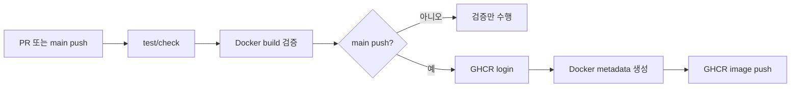

# MJUClaw 이미지 기반 배포

이 문서는 현재까지 구축된 MJUClaw 배포 구조를 정리한다. 목표는 운영 Windows PC에서 더 이상 여러 repo를 직접 clone/build하지 않고, GitHub Actions가 검증해 GHCR에 publish한 이미지를 pull해서 배포하는 것이다.

현재 배포 방식은 **반자동 CD**다. CI는 각 repo에서 자동으로 실행되고 이미지를 발행한다. 실제 운영 반영 시점은 운영자가 `mjuclaw-setup`에서 `release.env`를 고정한 뒤 `deploy.ps1`을 실행해서 결정한다.

---

## 현재 완료된 범위

완료된 배포 기반은 다음과 같다.

| 영역 | 상태 | 내용 |
|---|---|---|
| 서비스 CI | 완료 | 각 서비스 repo에서 테스트/빌드/Docker build 검증 |
| GHCR publish | 완료 | `main` push 시 GHCR image publish |
| Agent image | 완료 | `mjuclaw-setup`에서 `mjuclaw-agent` image build/publish |
| Production compose | 완료 | `docker-compose.prod.yml`로 GHCR image 기반 실행 |
| Release manifest | 완료 | `release.env.example`로 image/tag 조합 고정 방식 정의 |
| Windows deploy wrapper | 완료 | `deploy.ps1`로 pull/up 실행 |
| Health gating | 완료 | `deploy.ps1`이 agent/router/classifier health endpoint를 확인하고 실패 시 non-zero exit |
| Rollback 자동화 | 완료 | `.deploy/releases` snapshot 기반 수동 rollback과 `-RollbackOnFailure` 지원 |
| Preflight check | 완료 | `deploy.ps1 -CheckOnly`로 설정과 배포 대상 image/tag를 사전 검증 |
| 완전 자동 CD | 미완료 | self-hosted runner 기반 자동 배포는 아직 도입하지 않음 |

---

## Repo별 역할

| Repo | 역할 | 배포 산출물 |
|---|---|---|
| `mjuclaw-router` | Discord gateway, onboarding, intent gate, OpenClaw gateway forwarding | `ghcr.io/university-claw/mjuclaw-router` |
| `mju-public-data-worker` | 공지/학식 public data 수집 및 정규화 worker | `ghcr.io/university-claw/mju-public-data-worker` |
| `intent-classifier` | abuse/intent classifier FastAPI service | `ghcr.io/university-claw/intent-classifier` |
| `mjuclaw-setup` | 운영 compose, agent image build context, 배포 wrapper | `ghcr.io/university-claw/mjuclaw-agent` |
| `mju-cli` | agent/router image에 포함되는 학사 CLI | 별도 image 없음 |
| `mju-public-data-reader` | agent image에 포함되는 public data reader CLI | 별도 image 없음 |

`mju-cli`와 `mju-public-data-reader`는 production compose에 직접 등장하지 않는다. 두 repo는 `mjuclaw-agent` 또는 `mjuclaw-router` Docker build context 안에 포함되는 구성요소다. `mju-public-data-reader`는 Dockerfile 호환을 위해 build context에서 기존 경로명인 `mju-news`로 checkout된다.

---

## CI 단계

CI는 GitHub Actions에서 PR과 `main` push에 실행된다. 현재 목적은 세 가지다.

1. 코드와 설정이 깨지지 않았는지 검증한다.
2. Docker image build가 가능한지 검증한다.
3. `main`에 merge된 검증된 조합을 GHCR image로 publish한다.

### 서비스 repo CI

각 서비스 repo는 대체로 아래 흐름을 따른다.



`main` push에서 발행되는 tag는 다음 규칙을 따른다.

- `main`: 최신 main smoke test용 tag
- `sha-<short-sha>`: 운영 release pinning용 tag

운영 배포에서는 `main`보다 `sha-*` tag를 사용한다. `main`은 움직이는 tag라서 rollback 기준으로 적합하지 않다.

### mjuclaw-setup CI

`mjuclaw-setup` CI는 두 job으로 나뉜다.

| Job | 역할 |
|---|---|
| `Test and config checks` | Node test, `setup.sh` 문법 검증, `deploy.ps1` 문법 검증, local/prod/ngrok compose config 검증 |
| `Agent Docker build and publish` | `mjuclaw-agent` image build, `main` push 시 GHCR publish |

`Test and config checks`는 다음을 검증한다.

- `npm test`
- `bash -n setup.sh`
- PowerShell parser로 `deploy.ps1` 문법 검증
- local compose config
- prod compose config
- prod `public-data` profile config
- prod + ngrok compose config
- `deploy.ps1 -CheckOnly` preflight 동작

`Agent Docker build and publish`는 `mjuclaw-agent` image를 만든다. 이때 build context로 다음 repo를 함께 checkout한다.

- `university-claw/mju-cli` -> `mju-cli`
- `university-claw/mju-public-data-reader` -> `mju-news`

`main` push에서 발행되는 agent image는 다음과 같다.

```text
ghcr.io/university-claw/mjuclaw-agent:main
ghcr.io/university-claw/mjuclaw-agent:sha-<short-sha>
```

---

## CD 단계

현재 CD는 운영자가 승인 시점을 직접 정하는 반자동 방식이다.

```mermaid
flowchart LR
  A["각 repo main merge"] --> B["GitHub Actions CI"]
  B --> C["GHCR image publish"]
  C --> D["mjuclaw-setup release.env에 sha tag 고정"]
  D --> E["운영 PC에서 deploy.ps1 -CheckOnly 실행"]
  E --> F["배포 대상 image/tag 확인"]
  F --> G["운영 PC에서 deploy.ps1 실행"]
  G --> H["docker compose config 검증"]
  H --> I["docker compose pull"]
  I --> J["docker compose up -d"]
  J --> K["자동 health check"]
  K --> L{"health 실패?"}
  L -- "아니오" --> M["배포 성공 기록"]
  L -- "예 + RollbackOnFailure" --> N["이전 성공 release로 rollback"]
```



운영 PC는 build를 수행하지 않는다. 운영 PC의 책임은 pinned image를 pull하고 compose로 띄우는 것이다.

### CD 입력 파일

운영 배포에는 로컬에만 존재하는 env 파일 두 개가 필요하다.

| 파일 | 역할 | 커밋 여부 |
|---|---|---|
| `.env.production` | secrets와 런타임 설정 | 커밋 금지 |
| `release.env` | 배포할 image/tag 조합 | 커밋 금지 |

`release.env`는 `release.env.example`을 복사해서 만든다.

```powershell
Copy-Item release.env.example release.env
notepad release.env
```

예시는 다음 형태다.

```env
AGENT_IMAGE=ghcr.io/university-claw/mjuclaw-agent
AGENT_TAG=sha-replace-me

ROUTER_IMAGE=ghcr.io/university-claw/mjuclaw-router
ROUTER_TAG=sha-replace-me

WORKER_IMAGE=ghcr.io/university-claw/mju-public-data-worker
WORKER_TAG=sha-replace-me

CLASSIFIER_IMAGE=ghcr.io/university-claw/intent-classifier
CLASSIFIER_TAG=sha-replace-me
```

`release.env`에 `sha-replace-me` 같은 placeholder가 남아 있으면 `deploy.ps1`이 배포를 중단한다.

실제 컨테이너를 바꾸기 전에 아래 명령으로 preflight를 먼저 실행한다.

```powershell
.\deploy.ps1 -CheckOnly
```

`-CheckOnly`는 Docker와 필수 파일을 확인하고 compose config를 검증한 뒤, 실제로 배포될 image/tag 조합을 출력한다. 이 모드에서는 image pull, `up -d`, health check, rollback, `.deploy/` 기록 생성을 수행하지 않는다.

---

## Compose 구조

이 repo에는 두 가지 compose 경로가 있다.

| 파일 | 용도 |
|---|---|
| `docker-compose.yml` | 로컬 개발/초기 세팅용 build 기반 compose |
| `docker-compose.prod.yml` | 운영 배포용 GHCR image 기반 compose |
| `docker-compose.ngrok.yml` | ngrok tunnel profile |

운영에서는 `docker-compose.prod.yml`을 사용한다. 이 파일에는 `build:`가 없고 `image:`만 있다.

운영 기본 서비스는 다음 네 가지다.

- `mjuclaw-agent`
- `mjuclaw-router`
- `mjuclaw-classifier`
- `mjuclaw-public-data-worker`

옵션 profile:

- `ngrok`: `docker-compose.ngrok.yml`과 함께 사용
- `public-data`: bundled Postgres와 단일 `mjuclaw-public-data-worker` 사용

운영 PC의 `.env.production`에는 `COMPOSE_PROFILES=public-data`를 설정한다. 이 profile이 꺼지면 bundled Postgres와 `mjuclaw-public-data-worker`가 실행되지 않는다.

운영 compose에서는 `mjuclaw-worker`를 별도로 띄우지 않는다. public data 수집 scheduler는 `mjuclaw-public-data-worker` 하나만 실행한다.

public data 원본 첨부/이미지는 Docker volume인 `public-data-assets`에 저장된다. `mjuclaw-public-data-worker`는 이 volume을 `/data/assets`에 write mount하고, `mjuclaw-agent`는 같은 volume을 `/data/assets:ro`로 read-only mount한다.

기존 운영 PC에서 host bind mount `${STORAGE_LOCAL_ROOT}`를 사용해 왔다면, PR10 배포 전에 host asset을 Docker volume으로 병합한다. 이 명령은 host 파일을 삭제하지 않고, 없는 파일만 volume 쪽에 보강하는 용도다.

```powershell
$source = (Select-String -Path .env.production -Pattern '^STORAGE_LOCAL_ROOT=').Line -replace '^STORAGE_LOCAL_ROOT=', ''
docker run --rm --mount "type=bind,source=$source,target=/from,readonly" --mount "type=volume,source=mjuclaw-setup_public-data-assets,target=/to" alpine sh -c "cd /from && cp -a . /to/"
```

---

## 배포 스크립트

기본 배포 명령은 다음과 같다.

```powershell
.\deploy.ps1
```

자주 쓰는 옵션은 다음과 같다.

```powershell
.\deploy.ps1 -Ngrok
.\deploy.ps1 -CheckOnly
.\deploy.ps1 -PullOnly
.\deploy.ps1 -NoPull
.\deploy.ps1 -SkipHealthCheck
.\deploy.ps1 -RollbackOnFailure
.\deploy.ps1 -RollbackLatest
.\deploy.ps1 -Rollback .deploy\releases\20260515-123000
.\deploy.ps1 -EnvFile .env.production -ReleaseFile release.env
.\deploy.ps1 -HealthTimeoutSeconds 180 -HealthIntervalSeconds 10
```

스크립트가 수행하는 일:

1. Docker CLI 존재 확인
2. Docker daemon 동작 확인
3. Docker Compose 동작 확인
4. `.env.production` 확인
5. `release.env` 확인
6. `release.env` placeholder tag 방지
7. compose config 검증
8. `-CheckOnly`이면 배포할 image/tag 조합 출력 후 종료
9. image pull
10. `docker compose up -d`
11. legacy `mjuclaw-worker` orphan 컨테이너 제거
12. `docker compose ps` 출력
13. agent/router/classifier health check
14. public-data worker 최근 로그 출력
15. `.deploy/releases/<timestamp>`에 배포 기록 저장

옵션별 동작:

| 옵션 | 동작 |
|---|---|
| `-Ngrok` | `docker-compose.ngrok.yml`과 `ngrok` profile 포함 |
| `-CheckOnly` | Docker/env/release/compose 설정과 배포 대상 image/tag만 검증. image pull과 service 변경 없음 |
| `-PullOnly` | image pull까지만 수행하고 서비스 시작 생략 |
| `-NoPull` | 이미 pull된 image로 `up -d`만 수행 |
| `-SkipHealthCheck` | 배포 후 자동 health check 생략 |
| `-WaitHealthy` | health check 실행 의도를 명시적으로 드러내는 옵션. 기본값도 health check 실행 |
| `-HealthTimeoutSeconds` | health check 전체 대기 시간. 기본 120초 |
| `-HealthIntervalSeconds` | health 재시도 간격. 기본 5초 |
| `-RollbackOnFailure` | health check 실패 시 직전 성공 snapshot으로 자동 rollback |
| `-RollbackLatest` | 가장 최근 성공 snapshot으로 rollback |
| `-Rollback <path>` | 지정한 snapshot 디렉터리 또는 `release.env` 파일로 rollback |
| `-EnvFile` | 기본 `.env.production` 대신 지정한 env 파일 사용 |
| `-ReleaseFile` | 기본 `release.env` 대신 지정한 release manifest 사용 |

---

## 수동 배포 명령

`deploy.ps1`이 수행하는 기본 배포 명령은 아래와 같다.

```powershell
docker compose --env-file .env.production --env-file release.env -f docker-compose.prod.yml pull
docker compose --env-file .env.production --env-file release.env -f docker-compose.prod.yml up -d
```

ngrok까지 함께 띄울 때는 아래 명령을 사용한다.

```powershell
docker compose --env-file .env.production --env-file release.env -f docker-compose.prod.yml -f docker-compose.ngrok.yml --profile ngrok pull
docker compose --env-file .env.production --env-file release.env -f docker-compose.prod.yml -f docker-compose.ngrok.yml --profile ngrok up -d
```

GHCR package가 private이면 image를 pull하기 전에 로그인한다.

```powershell
docker login ghcr.io -u <github-user>
```

---

## Health Check

배포 후 최소한 아래 상태를 확인한다.

```powershell
docker compose --env-file .env.production --env-file release.env -f docker-compose.prod.yml ps
docker exec mjuclaw-agent curl -sS http://localhost:3001/health
docker exec mjuclaw-router curl -sS http://localhost:3100/healthz
docker exec mjuclaw-classifier curl -sS http://localhost:3200/healthz
docker logs mjuclaw-public-data-worker --tail 20
```

정상 신호:

- `mjuclaw-agent`, `mjuclaw-router`, `mjuclaw-classifier`, `mjuclaw-public-data-worker`가 Up 상태
- agent `/health` 응답 성공
- router `/healthz` 응답 성공
- classifier `/healthz` 응답 성공
- worker 로그에서 반복적인 crash/restart가 없음
- `mjuclaw-worker` legacy 컨테이너가 남아 있지 않음

실패 신호:

- compose service가 Restarting 또는 Exited 상태
- `mjuclaw-worker`와 `mjuclaw-public-data-worker`가 동시에 실행됨
- health endpoint가 timeout 또는 non-2xx 응답
- router가 Discord gateway에 연결하지 못함
- agent가 LLM/tool call 단계에서 반복 실패
- worker가 DB 연결 또는 OCR 초기화에서 반복 실패

`deploy.ps1`은 기본적으로 배포 후 agent/router/classifier health endpoint를 확인한다. 제한 시간 안에 모든 endpoint가 성공하지 않으면 non-zero exit로 종료한다. health check를 생략해야 하는 특수 상황에서는 `-SkipHealthCheck`를 명시한다.

`-RollbackOnFailure`를 함께 사용하면 health check 실패 시 직전 성공 snapshot의 `release.env`로 자동 rollback을 시도한다.

---

## 배포 기록과 rollback

`deploy.ps1`은 실행할 때마다 `.deploy/releases/<timestamp>` 디렉터리를 만들고 현재 배포에 사용한 `release.env` snapshot과 `deploy.json` 메타데이터를 저장한다.

`.deploy/`는 운영 PC의 로컬 기록이며 git에 커밋하지 않는다.

`-RollbackOnFailure`와 `-RollbackLatest`는 이전에 성공으로 기록된 snapshot이 있을 때만 사용할 수 있다. 첫 배포 전에는 rollback 대상이 없으므로, 첫 성공 배포 후부터 자동 rollback이 의미를 가진다.

배포 기록에는 다음 정보가 남는다.

- 배포 mode: `deploy` 또는 `rollback`
- 시작/종료 시각
- 사용한 env 파일 경로
- 사용한 release manifest 경로
- snapshot된 `release.env`
- ngrok 사용 여부
- health check 설정
- 배포 결과 상태
- 실패 메시지와 rollback 대상

가장 최근 성공 배포로 rollback하려면 아래 명령을 사용한다.

```powershell
.\deploy.ps1 -RollbackLatest
```

특정 snapshot으로 rollback하려면 snapshot 디렉터리 또는 snapshot 안의 `release.env`를 지정한다.

```powershell
.\deploy.ps1 -Rollback .deploy\releases\20260515-123000
.\deploy.ps1 -Rollback .deploy\releases\20260515-123000\release.env
```

rollback도 일반 배포와 동일하게 compose config 검증, image pull, `up -d`, health check를 수행한다. pull을 생략해야 하는 경우에만 `-NoPull`을 함께 사용한다.

---

## 현재 파이프라인 요약

현재 완성된 흐름은 아래와 같다.

```text
개발 repo PR
  -> GitHub Actions test/build/docker 검증
  -> main merge
  -> GHCR image publish (:main, :sha-<short-sha>)
  -> mjuclaw-setup release.env에서 배포할 sha tag 조합 선택
  -> 운영 Windows PC에서 .\deploy.ps1 -CheckOnly 실행
  -> compose config와 image/tag 조합 확인
  -> 운영 Windows PC에서 .\deploy.ps1 실행
  -> docker compose pull
  -> docker compose up -d
  -> 자동 health check
  -> 성공/실패 배포 기록 저장
  -> 실패 시 필요하면 이전 성공 snapshot으로 rollback
```

이 구조의 핵심은 운영 배포 단위를 “현재 로컬 checkout 상태”가 아니라 “검증된 image tag 조합”으로 바꾸는 것이다. 따라서 운영 PC에서 어느 commit이 떠 있는지 추적할 때는 `release.env`의 `sha-*` tag 조합을 보면 된다.

---

## 후속 작업

다음 단계에서 다룰 작업은 아직 완료되지 않았다.

1. 운영 PC 첫 배포 dry run
   - `release.env`를 실제 `sha-*` tag로 채운 뒤 `.\deploy.ps1 -CheckOnly` 실행
   - compose config와 image/tag 조합이 기대와 일치하는지 확인
   - 이어서 `.\deploy.ps1 -PullOnly` 실행
   - GHCR 권한과 image pull 가능 여부 확인

2. 운영 PC 실제 배포 리허설
   - 짧은 점검 창에서 `.\deploy.ps1 -RollbackOnFailure` 실행
   - `.deploy/releases` 기록 생성 확인
   - health 실패 시 rollback 동작 확인

3. 선택적 완전 자동 CD
   - Windows 운영 PC에 GitHub self-hosted runner 연결
   - GitHub Environments approval/protection 적용
   - 수동 승인 후 runner가 `deploy.ps1` 실행
