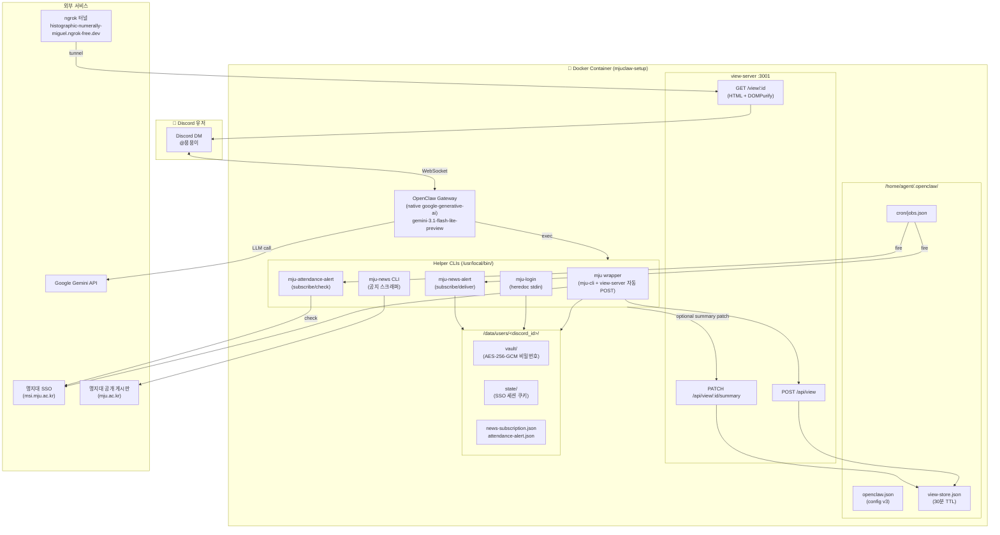
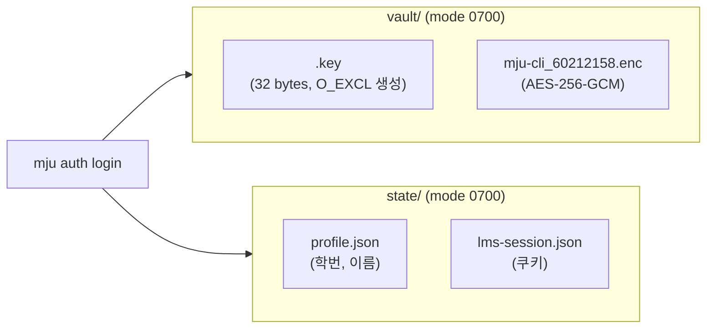
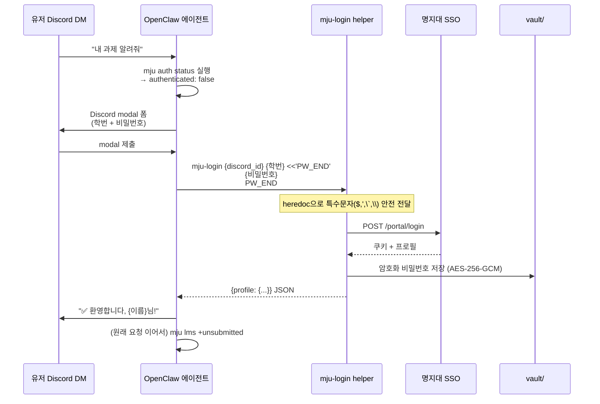
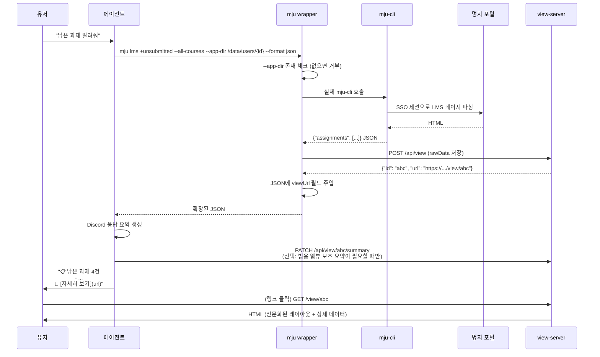
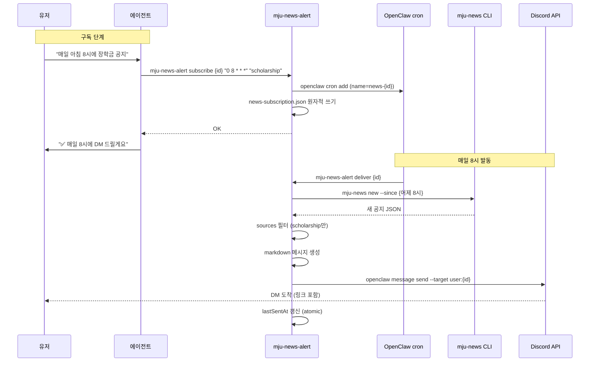
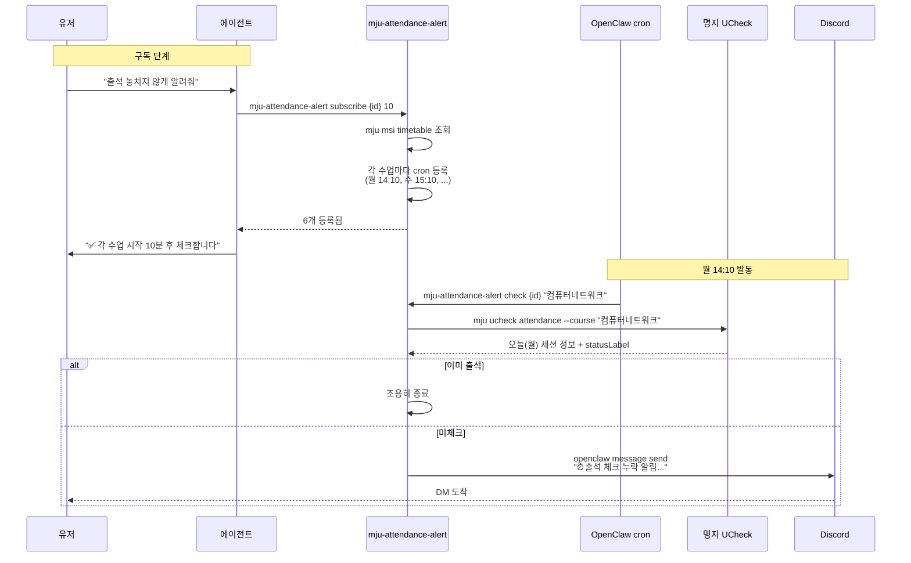
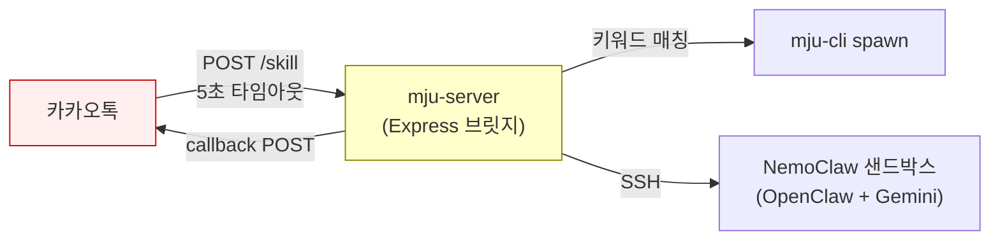
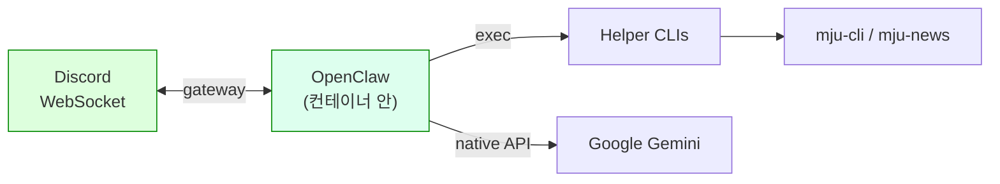

# MJUClaw 제작 진행 보고서

> 명지대학교 학사 AI 에이전트
> 최종 업데이트: 2026-04-15

---

## 1. 프로젝트 한 줄 요약

명지대학교 학생이 Discord DM으로 묭묭이(`@묭묭이`)에게 말을 걸면, AI 에이전트가 학교 포털(LMS/MSI/UCheck/도서관)을 대신 뒤져 학사 정보를 보여주고, 새 공지나 출석 누락을 먼저 알려주는 서비스.

---

## 2. 레포 3개 구성

```
mjuclaw/
├── mju-cli/        ← 학사 서비스 CLI 도구
├── mju-news/       ← 공개 공지 스크래퍼
└── mjuclaw-setup/  ← 에이전트 인프라 (오케스트레이터)
```

| 레포 | 역할 | 언어 | 배포 방식 | URL |
|---|---|---|---|---|
| `mju-cli` | 명지 SSO로 로그인해서 LMS/MSI/UCheck/도서관 데이터를 JSON으로 뽑는 CLI | TypeScript (Node 22) | Docker 이미지에 번들 | [GitHub](https://github.com/university-claw/mju-cli) |
| `mju-news` | 명지대 공개 게시판(일반/장학/행사/진로) 스크래퍼 | TypeScript (Node 22) | Docker 이미지에 번들 | [GitHub](https://github.com/university-claw/mju-news) |
| `mjuclaw-setup` | OpenClaw(에이전트 런타임) + view-server + 알림 helper들을 묶는 Docker 오케스트레이터 | TypeScript + Bash | 메인 저장소 | [GitHub](https://github.com/university-claw/mjuclaw-setup) |

책임 분리 원칙:
- **개인 데이터(성적/과제/출석)** → `mju-cli` (SSO 인증 필요)
- **공개 데이터(공지)** → `mju-news` (로그인 불필요, 가볍게 돌아감)
- **에이전트 로직/UX/배포** → `mjuclaw-setup`

---

## 3. 전체 아키텍처



---

## 4. 레포별 상세

### 4.1 `mju-cli` — 학사 서비스 CLI

**무엇을 하는가:**
명지대 SSO로 로그인한 상태에서 LMS/MSI/UCheck/도서관 페이지를 스크래핑/API 호출해서 깔끔한 JSON으로 뽑는다.

**주요 서브커맨드:**

| 서브커맨드 | 기능 |
|---|---|
| `auth login/logout/forget/status` | 크리덴셜 관리 (vault에 AES-256-GCM 암호화 저장) |
| `lms courses list` | 수강 과목 목록 |
| `lms notices/materials/assignments list/get` | LMS 강의 공지/자료/과제 |
| `lms +action-items` | 미제출 과제 + 마감임박 + 안읽은 공지 + 미수강 온라인 한 번에 |
| `lms +unsubmitted` / `+unread-notices` / `+incomplete-online` | 각 항목별 필터링 |
| `msi timetable` | 시간표 |
| `msi course-scores` | 현재 학기 수강점수 |
| `msi grade-history` | 지난 학기/전체 성적 이력 |
| `msi graduation` | 졸업요건 |
| `ucheck attendance` / `lectures list` | 과목별 출석 현황 |
| `library ...` | 도서관 좌석/스터디룸 예약 |

**크리덴셜 저장 구조:**



- **Windows**: Credential Manager 사용
- **macOS**: Keychain 사용
- **Linux (컨테이너)**: FilePasswordVault — AES-256-GCM + O_EXCL 원자적 키 생성 (race 안전)

---

### 4.2 `mju-news` — 공개 공지 스크래퍼

**무엇을 하는가:**
명지대 공식 웹사이트 4개 게시판을 주기적으로 긁어와 `data/notices.json` 단일 파일에 누적 저장. 로그인 불필요.

**대상 게시판:**
- `general` — 일반공지 (학사/등록/수강)
- `scholarship` — 장학/학자금공지
- `event` — 행사공지
- `career` — 진로/취업공지

**주요 명령:**

```bash
mju-news scrape         # 4개 사이트 병렬 스크랩 → data/notices.json 병합
mju-news list           # 저장된 공지 조회
mju-news new --since    # 증분 조회 (cron/알림용)
mju-news doctor         # 셀렉터 헬스체크
```

**설계 포인트:**
- Playwright/SQLite 안 씀 (저사양 cron 실행 용도)
- Notice `id`는 `articleNo`/`nttId` 같은 URL 파라미터로 고정 → 재스크랩해도 dedupe
- 스크래퍼별 부분 실패 허용 (한 사이트 다운이 전체 잡을 죽이지 않음)

---

### 4.3 `mjuclaw-setup` — 에이전트 오케스트레이터

**무엇을 하는가:**
3가지를 한 Docker 컨테이너에 묶음:

1. **OpenClaw gateway** — Discord에 직접 WebSocket 연결되는 에이전트 런타임
2. **view-server** — 학사 데이터 웹뷰를 HTML로 렌더링 (30분 TTL, persistence)
3. **Helper bash/node 스크립트들** — 에이전트의 shell escape / race / 분기 로직을 대신 처리

```
mjuclaw-setup/
├── Dockerfile              # node:22-slim + openclaw + mju-cli + mju-news 번들
├── entrypoint.sh           # config 생성 (v3 스키마 체크), cron 자동 등록
├── docker-compose.yml      # agent-data/news-data/user-data 볼륨 영속화
├── setup.sh                # 원클릭 셋업
├── bin/                    # /usr/local/bin/에 설치되는 helper들
│   ├── mju                  # mju-cli wrapper (view-server 자동 POST + viewUrl 주입)
│   ├── mju-login            # heredoc stdin으로 비밀번호 안전 전달
│   ├── mju-news-alert       # 뉴스 정기 알림 subscribe/deliver
│   └── mju-attendance-alert # 출석 누락 알림 subscribe/check
├── src/                    # view-server (TypeScript)
│   ├── view-server.ts       # Express
│   ├── view-store.ts        # 디스크 persistence + TTL
│   ├── view-renderer.ts     # 데이터 타입별 HTML 렌더러 + DOMPurify
│   └── types.ts
├── skills/                 # 에이전트 전용 skill 오버라이드
│   ├── mju-shared/SKILL.md  # Discord User ID 기반 --app-dir 규칙
│   ├── mju-msi/SKILL.md     # 현재 학기 성적 의도를 course-scores로 라우팅
│   └── mju-onboarding/SKILL.md
└── workspace/              # OpenClaw 에이전트 시스템 프롬프트
    ├── BOOTSTRAP.md         # 핵심 행동 규칙
    ├── IDENTITY.md          # 페르소나 (묭묭이 🦁)
    └── SOUL.md              # 톤, 보안 원칙
```

---

## 5. 주요 시나리오별 흐름

### 5.1 온보딩 (학사 서비스 첫 사용)



**핵심 포인트:**
- 비밀번호에 `$ ' " \` 특수문자 있어도 heredoc으로 안전 (shell 치환 차단)
- 암호화 키는 컨테이너 최초 실행 시 O_EXCL로 생성 → 동시 유저 race 안전
- SSO 쿠키는 `state/lms-session.json`에 0600 퍼미션, 원자적 쓰기

---

### 5.2 학사 데이터 조회 (과제/성적/시간표 등)



---

### 5.3 정기 뉴스 알림 (cron 기반)



**공용 scrape cron도 있음:**
- `mju-news-scrape` 이름으로 30분마다 `mju-news scrape` 실행 (전달 없음)
- `entrypoint.sh`가 컨테이너 시작 시 자동 등록
- 공용 `news-data` 볼륨에 저장 → 모든 유저가 같은 데이터 공유

---

### 5.4 출석 누락 선제 알림



---

## 6. 카카오 → Discord 마이그레이션

### 6.1 이전 (카카오톡 브릿지)



문제점:
- 5초 타임아웃 (에이전트가 길게 생각 못함)
- 푸시 불가 (유저가 물어볼 때만 응답)
- 900자/80자 메시지 제한
- mju-server가 점점 비대해짐

### 6.2 현재 (Discord 네이티브)



개선점:
- 타임아웃 없음 (에이전트가 tool 여러 번 호출 가능)
- **봇이 먼저 DM 가능** → 진짜 푸시 알림 (출석 누락, 새 공지)
- Embed / 마스킹된 링크 / 긴 메시지 전부 지원
- 브릿지 레이어 제거 (LLM이 직접 라우팅)

---

## 7. 핵심 해결 난제 & 수정 이력

| 문제 | 원인 | 해결 |
|---|---|---|
| NemoClaw 샌드박스에서 Discord WebSocket 1006 | OpenShell 프록시가 CONNECT 터널 ~2분 타임아웃 (GitHub #409) | NemoClaw 포기하고 plain Docker로 전환 |
| Gemini OpenAI-compat API 400 "status code (no body)" | tool schema에 orphaned `required` 필드 | `api: "google-generative-ai"` 네이티브 전환 + OpenClaw 2026.4.11 업데이트 |
| 비밀번호 `$` 포함 시 로그인 실패 | bash 변수 치환 | `mju-login` helper + heredoc stdin |
| 비밀번호 `'` 포함도 실패 | single quote escape | heredoc(quoted marker)로 완전 우회 |
| cron delivery "Unknown Channel" | cron `--announce` 가 DM 채널 못 resolve | helper가 `openclaw message send` CLI 직접 호출 |
| 유저별로 다른 에러 | SKILL.md가 존재하지 않는 명령어 예시 사용 | 12개 SKILL.md 실제 CLI와 정렬 |
| 링크 누르면 빈 페이지 | 렌더러가 `assignments`/`notices` 필드 못 찾음 (items만 봄) | 실제 필드 구조 반영한 렌더러 |
| "30분 후 만료"를 바로 보여줌 | view-store 메모리만 쓰고 재시작에 소실 | 디스크 persistence (JSON + atomic write) |
| 범용 웹뷰의 보조 요약이 비어있음 | wrapper는 rawData만 POST, aiResponse는 ""로 둠 | PATCH `/api/view/:id/summary` 엔드포인트 유지. 단, 전문 웹뷰는 렌더러 브리핑을 우선하고 `aiResponse`를 숨길 수 있음 |
| view-server XSS | `marked.parse(aiResponse)` 후 innerHTML | 서버사이드 마크다운 + DOMPurify |
| 외부에서 view POST 가능 | origin 검증 없음 | localhost/RFC1918만 허용 |
| file-vault race condition | 두 유저 동시 첫 로그인 시 키 파일 충돌 | `O_CREAT|O_EXCL` 원자적 생성 |
| 세션 파일 umask 기본값 | 0644 등으로 저장 | `mode: 0o600` 명시 + 원자적 쓰기 |
| `--app-dir` 없으면 데이터 공유 | wrapper가 검증 안 함 | wrapper에서 거부 (auth/config/doctor 제외) |
| 오래된 config 업데이트 무력화 | `if exists: skip` 로직 | 스키마 버전 마커 (현재 v3) 체크 |

---

## 8. 현재 상태 체크리스트

### ✅ 완료

- [x] OpenClaw + Discord 직접 연결 (native WebSocket)
- [x] Gemini 네이티브 API 전환
- [x] 유저별 격리 (vault + state + 세션 per discord_id)
- [x] 비밀번호 특수문자 안전 (mju-login heredoc)
- [x] view-server + ngrok 공개 URL
- [x] 데이터 타입별 HTML 렌더러 (시간표/성적/과제/출석/공지/졸업요건)
- [x] view-store 디스크 persistence (재시작 생존)
- [x] AI 요약 PATCH 엔드포인트
- [x] 뉴스 정기 알림 (유저별 구독)
- [x] 출석 누락 선제 알림 (수업별 cron)
- [x] 공용 mju-news scrape (30분)
- [x] XSS 차단 (marked + DOMPurify 서버사이드)
- [x] view-server POST 접근 제한 (localhost + RFC1918)
- [x] 원자적 파일 쓰기 (vault, session, 구독, view-store)
- [x] SKILL.md 실제 CLI와 정렬
- [x] 설정 스키마 버전 마커 (v3)

### 🚧 미완 / 개선 여지

- [ ] 외부 DB 연동 (현재는 컨테이너 볼륨에만 저장 — 재배포 시 볼륨 보존 필요)
- [ ] 온보딩 대화에서 알림 구독까지 자동 유도
- [ ] 시간표 변경 시 출석 cron 자동 refresh (현재 수동)
- [ ] `--app-dir` 인자 → 환경변수로 자동 주입 (에이전트가 빼먹을 가능성 제거)
- [ ] 유저별 프로필 파일 (`preferences.json`) — 존댓말/반말, 관심 과목 등

---

## 9. 배포 & 운영

### 9.1 원클릭 셋업

```bash
git clone https://github.com/university-claw/mjuclaw-setup.git
cd mjuclaw-setup
./setup.sh
```

첫 실행: `.env.example` → `.env` 생성 후 다음 값 채우기:
- `DISCORD_BOT_TOKEN`
- `GEMINI_API_KEY`
- `VIEW_BASE_URL` (ngrok 도메인)

두 번째 실행: mju-cli/mju-news 자동 clone → Docker 빌드 → 컨테이너 기동.

### 9.2 영속 데이터 볼륨

| 볼륨 | 마운트 경로 | 포함 내용 |
|---|---|---|
| `agent-data` | `/home/agent/.openclaw` | config, cron jobs, view-store, 페어링 |
| `news-data` | `/opt/mju-news/data` | 공지 JSON (공용) |
| `user-data` | `/data/users` | 유저별 vault/state/구독 설정 |

### 9.3 외부 종속성

- **Docker** — 컨테이너 런타임
- **ngrok** — view-server 공개 터널 (호스트에서 `ngrok http --domain=<고정> 3001`)
- **Gemini API Key** — LLM 추론
- **Discord Bot Token** — 봇 인증

### 9.4 모니터링

```bash
# 로그
docker logs -f mjuclaw-agent

# cron 현황
docker exec mjuclaw-agent openclaw cron list

# 유저 상태
docker exec mjuclaw-agent ls /data/users/

# view-store 상태
docker exec mjuclaw-agent cat /home/agent/.openclaw/view-store.json | jq 'length'
```

---

## 10. 현재 운영 지표 (2026-04-15)

- 등록 유저: 4명
- 활성 cron 수: 7개 (공용 1 + 출석 6)
- 지원 dataType 렌더러: 12종
- 총 라이브 테스트 시간: ~3일
- 최근 해결 이슈: view-renderer 필드 mismatch, AI 요약 빈 카드, view-store 휘발성

---

## 11. 앞으로

우선순위 순:

1. **외부 DB** — 유저/구독/알림 이력을 컨테이너 바깥 Postgres 등에 저장 (수평 확장/백업)
2. **온보딩 UX** — 로그인 후 알림 구독까지 대화형 안내
3. **자동 시간표 refresh** — 학기 중 수강 변경 감지 → 출석 cron 자동 재빌드
4. **관심사 기반 뉴스 필터** — 키워드/학과 기반 알림
5. **과제 마감 임박 알림** — 'N시간 전' 푸시
6. **성능 모니터링** — 에이전트 응답 지연, LLM 토큰 사용량 대시보드
